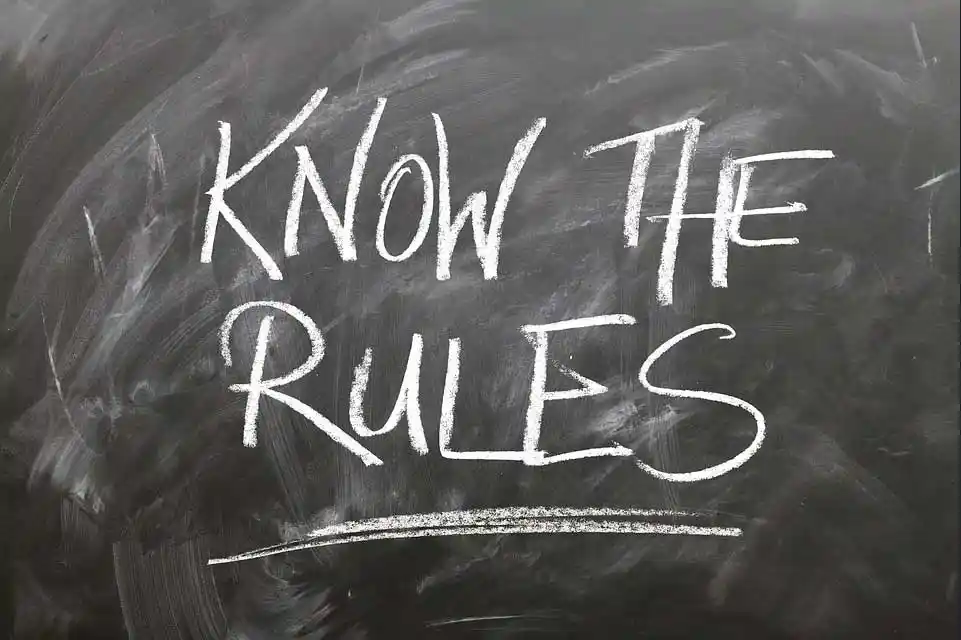

## Conduct

- Never cheat or engage with additional partners in an exclusive dynamic.
- Never openly talk/brag/share photos about your BDSM relationships, unless that is agreed upon. People often expect anonymity and privacy in BDSM as not to affect their personal and/or professional life.
- Educate yourself on safety concerns for any kink you wish to practice,
- Never stop learning, always come in with an open mind and ears.
- Never save screenshots, take photo, videos etc.. without clear permission.
- Never use your dynamic to abuse and manipulate in an unhealthy way. Follow your partner's limits and follow what they say.
- Do not use your safe word as a joke, it devalues its importance, which is harmful.
- If you are uncomfortable/something is not right, stop. Do not push yourself beyond your limits just to appease someone. Your personal safety comes first. Those who don't speak up often sooner, regret it later when they push a limit.
- Do not underestimate the headspace of a submissive. Some submissives may consent to something they would not otherwise when feeling submissive. As a Dominant, you should be cautious around pushing boundaries within scenes and know the limits of your submissive before trying new things.
- It's not encouraged to use substances or drink when in a scene, having a sober mind in BDSM is heavily encouraged for safety. Do so at your own risk.

## House Rules

If you ever partake in a local event or community, check their own rules and expectations before diving in. Many have specific rules that may not be obvious, such as no phone/camera use or drinking. Rules like these exist to ensure the privacy and safety of attendees. If you are unsure about something, reach out beforehand and ask if something is alright.
